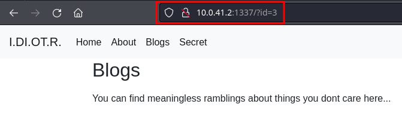

# Target [idiotr](https://echoctf.red/target/41 "Target: idiotr")  | Writeup en Español

---
#### El reto nos da dos descripciones en las que hay pistas, así que analicémoslas:

---

## Primera pista

>Ixxxxxxx Dixxxx Oxxxxt Rxxxxxxxx

Analizando la primera pista, parece ser un nombre en el que se censuraron letras con x, pero podemos buscar las iniciales:

Ixxxxxxx Dixxxx Oxxxxt Rxxxxxxxx 

**I D O R**

Al buscarlas en Google, nos aparece el contenido completo de la pista:

>Insecure Direct Object Reference

Esta es una vulnerabilidad en aplicaciones web donde se expone una referencia directa a objetos internos sin verificar autorización, permitiendo a usuarios acceder o modificar datos no autorizados.

Habiendo entendido esto, pasemos a la segunda pista y su análisis.

---

## Segunda pista
> See if you can find the *hidden* page. Do not overcomplicate things, keep it simple. To start the challenge connect to http://10.0.41.2:1337/. Your timer starts from the first time you connect to the service.

Traducción
> Mira si puedes encontrar la página *oculta*. No te compliques demasiado, mantenlo simple. Para comenzar el desafío, conéctate a http://10.0.41.2:1337/. Tu temporizador empieza desde la primera vez que te conectes al servicio.

En esta pista, notamos que tiene resaltado el *oculta*, por lo que podemos intuir que nos pide encontrar una página escondida y nos da la URL de la web directamente. Habiendo solamente un servicio, no se requerirá escanear puertos.

---

## Ingresamos a la página y utilizamos lo aprendido en las pistas

Al entrar a la web, no parece haber nada raro, pero tiene un menú de pestañas por las que nos podemos mover. Así que vamos a la primera opción. Dado que estamos en el Home, iremos a About:

Aquí la URL ha cambiado, agregando **/?id=2** a la URL del home, lo que quiere decir que le estamos pasando el parámetro id como 2. Tomando en cuenta las pistas que nos dieron, debemos encontrar una página escondida a través de este parámetro. Vayamos a las otras páginas del menú a ver si encontramos algo interesante.

---

---

## Análisis final
Debido a que es un IDOR, podemos saber que vamos en el camino correcto. Debemos encontrar una página *oculta* modificando el parámetro id para encontrarla. Podríamos realizar una fuerza bruta para intentar encontrarla, pero en este caso, cada una de las secciones del menú nos daba las siguientes URLs:
1. http://10.0.41.2:1337/
2. http://10.0.41.2:1337/?id=2
3. http://10.0.41.2:1337/?id=3
4. http://10.0.41.2:1337/?id=4

Pero la primera página debería ser el index, así que, ¿dónde quedó el id=1?
Lo probamos y:

