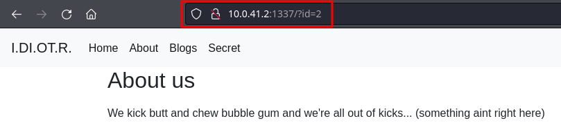
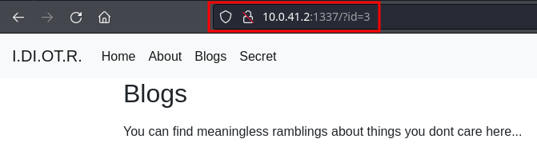
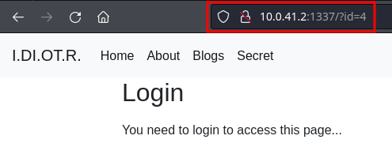

# Target [idiotr](https://echoctf.red/target/41 "Target: idiotr")  | English Writeup

---
#### The challenge gives us two descriptions that contain hints, so let's analyze them:

---

## First hint

>Ixxxxxxx Dixxxx Oxxxxt Rxxxxxxxx

Analyzing the first hint, it seems to be a name with letters censored by x, but we can look up the initials:

Ixxxxxxx Dixxxx Oxxxxt Rxxxxxxxx 

**I D O R**

When we search for them on Google, the full hint appears:

>Insecure Direct Object Reference

This is a vulnerability in web applications where a direct reference to internal objects is exposed without verifying authorization, allowing users to access or modify unauthorized data.

Having understood this, let's move on to the second hint and its analysis.

---

## Second hint
> See if you can find the *hidden* page. Do not overcomplicate things, keep it simple. To start the challenge connect to http://10.0.41.2:1337/. Your timer starts from the first time you connect to the service.

Translation
> See if you can find the *hidden* page. Do not overcomplicate things, keep it simple. To start the challenge, connect to http://10.0.41.2:1337/. Your timer starts from the first time you connect to the service.

In this hint, we notice that the word *hidden* is highlighted, so we can infer that we are asked to find a hidden page and are given the URL of the web directly. Since there is only one service, it won't be necessary to scan ports.

---

## We enter the page and use what we learned from the hints

When entering the web, nothing seems out of the ordinary, but it has a tab menu that we can navigate through. So let's go to the first option. Since we are on the Home page, we will go to About:

Here the URL has changed, adding **/?id=2** to the home URL, which means we are passing the id parameter as 2. Taking into account the hints we were given, we need to find a hidden page through this parameter. Let's go to the other pages of the menu to see if we find something interesting.

---

---

## Final Analysis
Since it is an IDOR, we can know that we are on the right track. We need to find a *hidden* page by modifying the id parameter to find it. We could perform a brute force to try to find it, but in this case, each of the menu sections gave us the following URLs:
1. http://10.0.41.2:1337/
2. http://10.0.41.2:1337/?id=2
3. http://10.0.41.2:1337/?id=3
4. http://10.0.41.2:1337/?id=4

But the first page should be the index, so where is id=1?
We tried it and:

